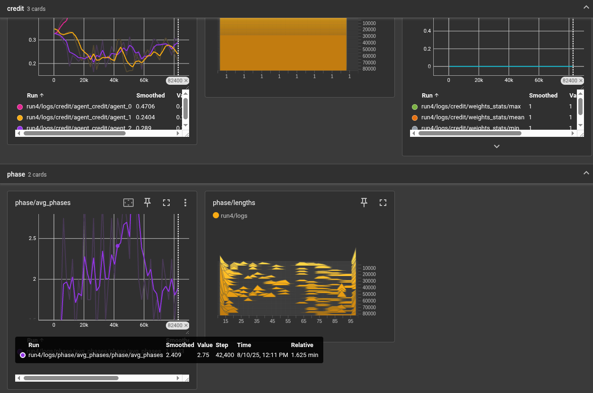
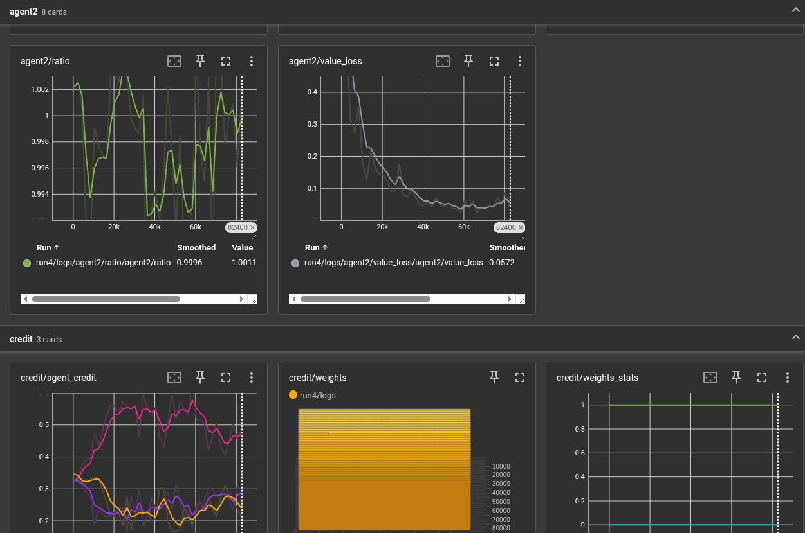
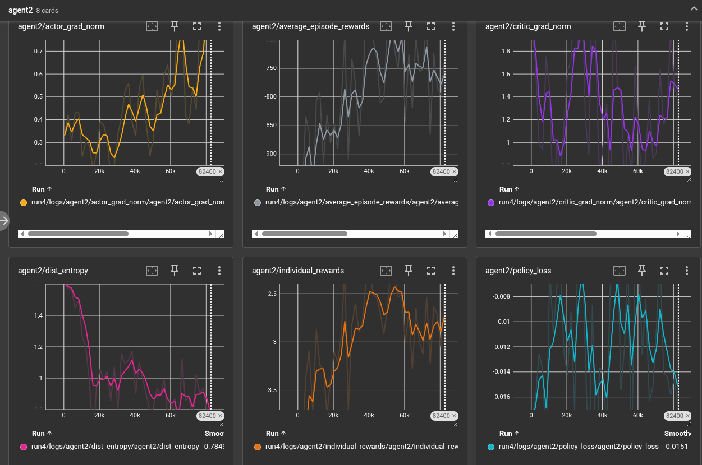
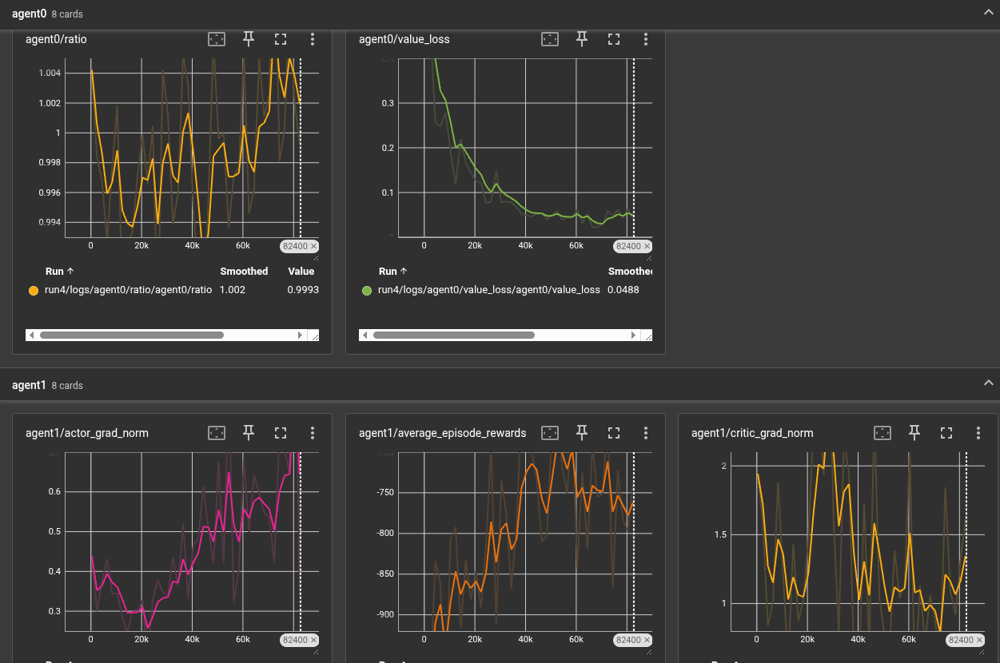
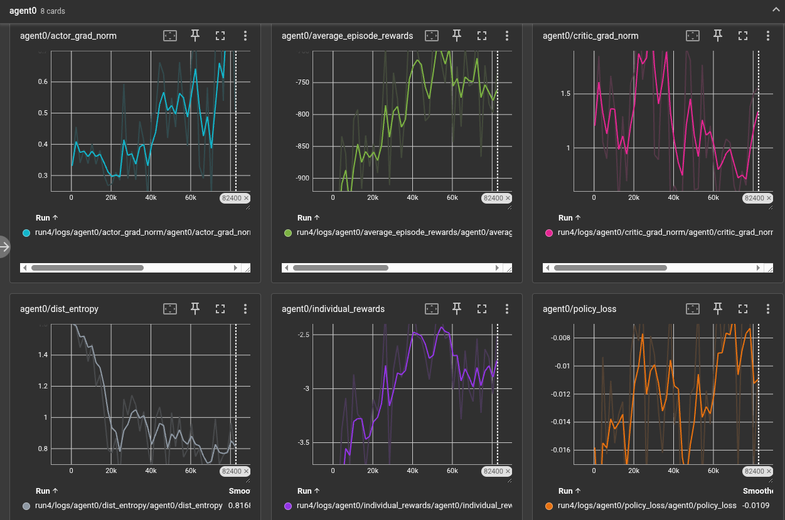

# Phase-Wise Shapley Credit Assignment in MARL (MAPPO Framework)

This repository extends the official [MAPPO framework](https://github.com/marlbenchmark/on-policy) with a novel **phase-wise Shapley value credit assignment method** for addressing the **credit assignment and interpretability problem** in Multi-Agent Reinforcement Learning (MARL).  

Our approach decomposes agent credit assignment along the **temporal dimension** of an episode, computes **Shapley-based credit per phase**, and then aggregates credits with a **temporal decay mechanism**. This allows more interpretable and robust training compared to uniform or shallow credit distribution.

---

## 🚀 Motivation

- Standard MARL methods (COMA, VDN, QMIX) distribute rewards uniformly or with shallow credit signals.  
- They fail to capture **long-term dependencies** and **temporally extended cooperative tasks**.  
- Our method:  
  - Segments trajectories into **phases** (e.g., exploration → collaboration → execution).  
  - Computes **Shapley credit** within each phase.  
  - Aggregates with **temporal decay weighting**.  

This provides **interpretability** (phase-credit heatmaps), **credit fidelity**, and better **training efficiency**.

---

## 📖 Method Overview

1. **Phase Segmentation**
   - Reward change-points  
   - State thresholds  
   - Learned change-point detection  
   - Fixed time windows (fallback)  

2. **Phase-wise Shapley Credit Assignment**
   - Approximate Shapley values with Monte Carlo sampling / truncated permutations  

3. **Temporal Decay Aggregation**
   - Weight credits across phases using exponential decay or learnable weights  

4. **Policy Integration**
   - Use shaped advantages in MAPPO (on-policy gradient)  

---

## 📊 Example Results

Below are TensorBoard logs from basic experiments (MPE environments).  

| Agent Training | Credit Assignment | Phase Analysis |
|----------------|------------------|----------------|
|  |  |  |
|  |  |   |

Results show **clear phase-level decomposition** and **improved interpretability** of agent contributions.

---

## ⚙️ Installation & Usage

Clone this repo:
```bash
git clone https://github.com/YOUR_USERNAME/mappo-colab.git
cd mappo-colab
```
Install dependencies:
```bash
pip install -r requirements.txt
```
Run training:
```bash
python train/train_mappo.py --env_name mpe --algorithm_name mappo --use_phasewise_shapley
```

Visualize results:
```bash
tensorboard --logdir ./logs
```
---

## 🤝 Contributing

We welcome contributions to improve this research framework.
Steps to Contribute

1. Fork the repository.

2. Create a new branch:
```bash
git checkout -b feature-name
```

Make your changes and commit:
```bash
git commit -m "Add feature-name"
```

Push and open a Pull Request.
For details, see our [Contribution Guidelines](CONTRIBUTING.md).

---
## 📜 Code of Conduct
We are committed to providing a welcoming environment.
Please read our [Code of Conduct](CODE_OF_CONDUCT.md) before contributing.

 ---
## 📜 License
This project is licensed under the MIT License - see the [LICENSE](LICENSE) file for details.

---
## 📑Citation
If you find this work useful, please cite:
```bibtex
Karan Bhatia, Phase-Wise Shapley Credit Assignment for Temporal Decomposition in Multi-Agent Reinforcement Learning, 2025.
```
